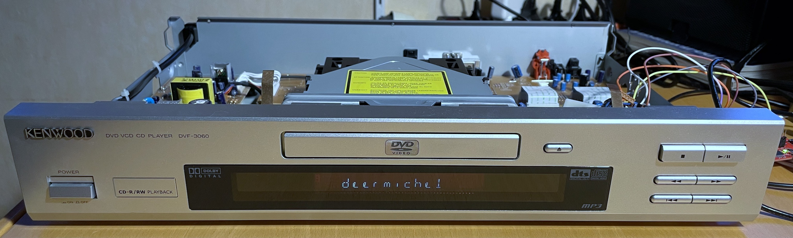
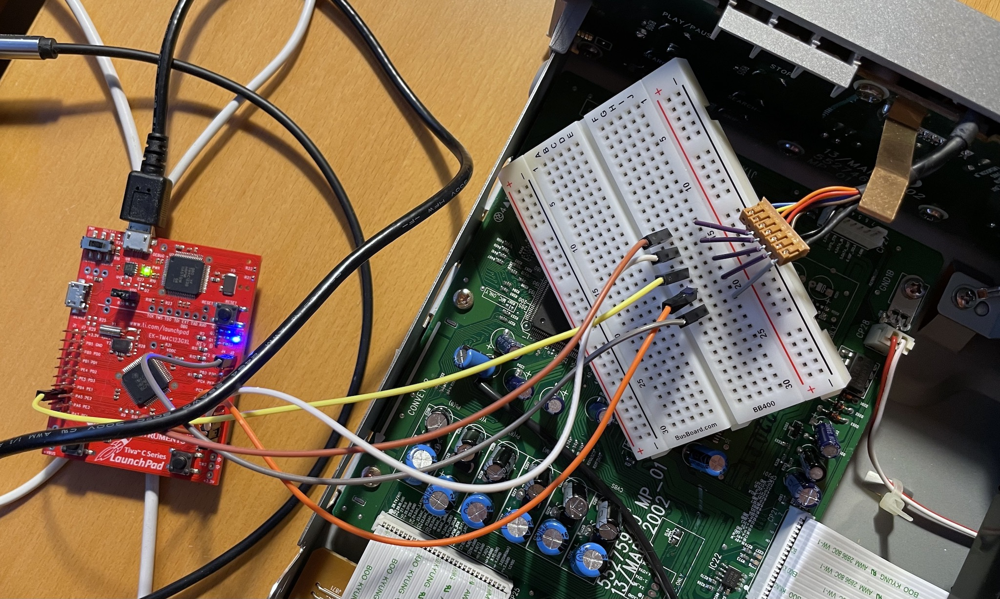
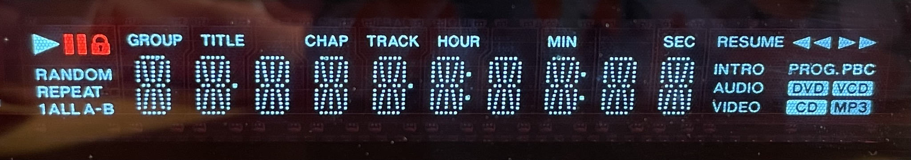

# dvf3060



I picked up an old Kenwood DVF-3060 DVD player and decided to reverse engineer the front panel for a future project.
The panel features a fancy vacuum fluorescent display (VFD) and some buttons, all controlled through a PT6311 (or UPD16311) IC.
This repo contains the C++ driver I wrote for a Cortex-M based TI eval board (TM4C123G LaunchPad) to communicate with the controller via SPI.

## Features
- Set and clear characters in up to 10 positions
- Complete ASCII font (14 segments are quite limiting though)
- Set and clear icons
- Poll key states
- Layered architecture for easy porting to other hardware

More PT6311 features (display modes, dimming, LEDs, switches, etc.) are implemented by the controller layer (see [pt6311.h](src/pt6311.h)), but not used for the DVF-3060 front panel.

## How to
The project runs out of the box with [PlatformIO](https://platformio.org/) and comes with a [timer example](src/main.cpp).

The pinout is configured as follows (make sure your board supports **5V logic levels!**):
| TM4C123 | PT6311 / front panel board | Function    |
| ------- | -------------------------- | ----------- |
| PA3     | 3. VFD_STB                 | SSI0 SS     |
| PA4     | 4. VFD_DATA_OUT            | SSI0 MISO   |
| PA5     | 5. VFD_DATA_IN             | SSI0 MOSI   |
| PA2     | 6. VFD_CLK                 | SSI0 CLK    |
| GND     | 7. GND                     | GND         |



## Usage
```cpp
// include and create instance
#include "dvf3060.h"
DVF3060 dvf3060;

// init display (also controller and HAL)
dvf3060.init();

// clear display
dvf3060.clearDisplay();

// set and clear a character (position 0-9)
dvf3060.setChar('A', 4);
dvf3060.clearChar(4);

// set and clear an icon (see dvf3060_font.h for available icons)
dvf3060.setIcon(DVF3060_ICON::HOUR);
dvf3060.clearIcon(DVF3060_ICON::HOUR);

// poll key state (see dvf3060.h for available keys)
if (dvf3060.getKeyState() & DVF3060_KEY_PLAY) {/* ... */}

// see main.cpp for a complete example
```

#### All segments and icons enabled:


## Implementation
There are several abstraction layers that allow you to easily port the driver to a new platform or similar display configurations.
- HAL (hardware abstraction layer): Contains platform-specific code to make upper layers work regardless of the underlying platform (TM4C123 in my case). To port this driver to a new platform (e.g., Arduino or RP2040), implement the required methods (see [tm4c.h](src/tm4c.h) as a reference).
- Controller layer: Implements the SPI protocol as specified in the IC datasheet by using the HAL methods. For use with the DVF-3060 front panel, only PT6311 is relevant, but related controllers like the PT6312 can be supported in a similar fashion.
- Display layer: This is the frontend part of the driver which allows simplified control over characters and icons. It is based on the controller layer and comes with a predefined [ASCII font](src/dvf3060_font.h).

## Related
- Some inspiration for the ASCII font: [LED-Segment-ASCII](https://github.com/dmadison/LED-Segment-ASCII)
- More inspiration for the ASCII font: [The Super VMW CPU Meter](http://www.deater.net/weave/vmwprod/meter/super.html)
- Arduino library for the PT6312 controller: [PT6312_VFD_Arduino_Library](https://github.com/ysard/PT6312_VFD_Arduino_Library/)
- PT6311 datasheet: [Google](https://www.google.com/search?q=pt6311+datasheet)
- UPD16311 datasheet: [Google](https://www.google.com/search?q=upd16311+datasheet)
- DVF-3060 service manual: [Google](https://www.google.com/search?q=dvf-3060+service+manual)

## Future work
If I'm super motivated, I might create some videos about the reverse engineering process, because you don't really need a datasheet to figure out how the controller works.

There's also an IR receiver on the front panel board, but I haven't looked into it yet (and I also don't have the remote control anymore).

## License
This project is released under the [MIT License](LICENSE).


